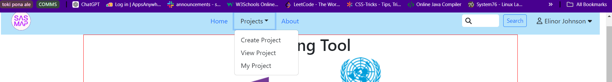

# United Nations Sustainable Development Goals Mapping Tool - SDP2024-Group2 

## About

In 2015, the United Nations set forth 17 Goals for Sustainable Development and challenged its members to achieve them by 2030. Saskatchewan Polytechnic, like many other Canadian institutions, seeks to support the Government of Canada in its efforts to meet these goals. Consequently, the school began capturing details about how the applied research activities it funds and undertakes contribute towards their achievement.

Initially, this tracking was done by the Saskatchewan Polytechnic Office of Applied Research and Innovation (OARI). using a spreadsheet to record the projects as rows, and the 17 goals as columns, marking '1' under each goal that a project fit into. While this method was accurate enough, we were tasked with improving the process, primarily by enhancing the accessibility and readability of the records through visual mapping. We achieved this by converting the tabular data into graphical charts, allowing readers to sift through and select the ones they feel most comfortable interpreting.

We also aimed to improve transparency regarding how individual projects contribute to each goal by increasing the granularity of measurement. Instead of mapping projects directly to a goal, Researchers now map their projects to each goal's related targets. This allows readers to gain a better understanding of how each project contributes to each goal at a glance. Additionally, for those curious about how the targets themselves are measured, we included information on each target's indicators.

Currently, the project focuses on modeling the experience of Researchers. Researchers have the capability to view projects, create and map them, and search across them using a search bar and/or filtering by goal.

In the future, we plan to expand the user base to include Administrative users and Academic Leads, each with distinct roles and functionalities. Administrative users will oversee user and database administration, while Academic Leads will have an enhanced ability to compare projects against each other. Additionally, general users, who are not required to log in, will be able to view and search for projects.

This is a brief overview of the project's current status and future plans. For detailed information about installation, implementation, and usage, please refer to the relevant sections below.

## Dependency Installation

The SDG Mapping Tool is built mostly using React in conjunction with Vite for the front end and Node.js for running the server on the back end. Information management is handled via MySQL. 

The versions used for this build were:

- [Node v21.7.0](https://nodejs.org/en/download/prebuilt-installer/current) (also a prerequisite for Vite)
- [VITE](https://vitejs.dev/guide/) [v5.2.11](https://www.npmjs.com/package/vite/v/5.2.11)
- [MySQL Server Community Edition 8.0.37 (in conjunction w/ MySQL Workbench 8.0.36)](https://dev.mysql.com/downloads/workbench/)

- [git](https://www.git-scm.com/downloads) (not a dependency per se, but required to obtain and run the project locally)

Click the links above and follow the guidelines to install these dependencies. 

## Project Installation & Setup

To run the Mapping tool, the Project has to first be obtained and setup. 

### Obtaining the Project
The git repository is currently set to private so the first step would be to contact the owner, seatonj@saskpolytech.ca, to request a zipped copy of the files or access to the repository.

If accessing the repository, the easiest solution would be to download the project in zip format. 


Figure 1 - Option to Download Zip from Repository

If you are unable to obtain the zip file, you can try the following alternative method:
- Copy the link address from the repository in order to clone it.


Figure 2 - Option to Clone from Repository

- Open your terminal program and navigate to the directory in which you wish to install the project.
- Clone the project into the directory by using the command:

    ```
        git clone <paste-repository-link-here>
    ```


Figure 3 - Example of Successful git clone process

- Once the download is complete, switch to the project directory, SDP2024-Group2:
    
    ```
       cd SDP2024-Group2
    ```

### Database Setup
(This section assumes you have installed MySQL and MySQL Workbench as per the instructions [above](#dependency-installation).)
- Navigate to the SQLProject folder:

    ```
        cd SQLProject
    ```

- Running this command should open the file in Workbench: 
    
    ```
        Grp2_SDG_Mapping_Tool_DB.sql
    ```


Figure 4 - Example of navigation to SQL folder

- When Workbench opens, make sure your script will run by reconnecting to the server if you were not connected already:


Figure 5 - Location of Reconnect to Server option in Workbench


Figure 6 - Connect to Database Screen (Click OK)

- Once that is done run the script (<b>Be Advised</b> - the first line drops the database before recreating it. If you do <b>NOT</b> want to drop an existing <b>mappingtool</b> database but still need to run the file or parts of it, be sure to comment out the first line):


Figure 7 - 

- Ensure you have a user setup that you will use to connect to the database in the next section:


- Once complete navigate back to the main project folder, SDP2024-Group2:

    ```
        cd ..
    ```

### Backend Installation & Setup
- Navigate to the ApiProject folder:

    ```
        cd ApiProject
    ```

- From here run the following command:

    ```
        npm i cors
    ```


- Once completed, navigate to the following location:

    ```
        cd db
    ```

- Use your preferred editor to open the connect.js file located there and edit the user name and password to match the ones you intend for your database to use. Once complete navigate back to the ApiProject folder:

    ```
        cd ..
    ```
    


- Type the following to start the Mapping Tool server

    ```
        npm start
    ```

- If the connection was set up correctly you should receive a positive message like this:


- Doing this will, however, tie up your terminal. In order to continue, you will need to open a new terminal and navigate back to the project folder (do <b>NOT</b> close the current one).

### Frontend Installation & Setup

- In your new terminal navigate to the ReactProject folder.

    ```
    cd ReactProject
    ```


- Once there, run the following command:

    ```
    npm i
    ```
    


- When the installation process is completed, the Mapping Tool application can be started by typing:

    ```
    npm run dev
    ```

- After it has started up it can be launched by simply typing 'o' and pressing enter at this screen.


If this point has been reached without issue, the product has been successfully installed.

## Mapping Tool Usage

As stated earlier, the Mapping Tool in its current state replicates the experience of a Researcher User (in this case hard coded to Elinor Johnson, User Id - 3), the sort we envision as the main user type. There are 5 main sections of the app that can be visited by such a user: 

- [The Home page](#home-page)
- [The Create Project page](#create-project-page)
- [The View Projects page]() 
- [The My Projects page]()
- [The About page]()

These can all be navigated to via the navigation bar at the top of any given screen.


Figure 16 - Navbar Fully Expanded

### Home Page
This page briefly outlines the purpose of the mapping tool. Also, provided at the bottom and replicated in the About Page and View Project page, there are tiles representing the 17 Goals that will take you to the relevent UN site if you click them (e.g., Clicking Goal 1 will take you to the UN's site detailing Goal 1).


Figure 17 - Home page 


Figure 18 - Links at the bottom of Home Page

### Create Project Page

On this page, a researcher can create new projects and map their contributions towards each SDG by selecting specific targets under each goal that the project aligns with. A mapping guide is also available to walk the user through the process if desired.


Figure 19 - Mapping Guide Operation

To create a project, First enter the Project Name, any related tags (currently marked as Project Category), and the project description in the provided fields. The name is automatically field is automatically filled with the name of the creating researcher.


Figure 20 - Fields to Fill in Creation Screen

Once those sections are filled mapping can be initiated by clicking one of the tiles at the bottom which will, in this case, display the targets associated with that goal.


Figure 21 - New project with goal 4 selected

Clicking on targets will map their related goal to the project, dynamically updating the selected visualizer (Bar chart by default). Other visualizations, such as Radar and Pie chart can be selected from the dropdown menu.


Figure 22 - Visualization Drop Down

If more information about a target is required, the indicator button on the top right of the target card can be clicked to show more information. A percentage based on the number of targets related to the goal will be displayed for each bar. Once the relevant targets for a goal are mapped other goals can be clicked in order to add them to the project in the same way.


Figure 23 - Example of target selection 

Once the project has finished being mapped the user can save the information to the database by clicking the Create Project button. A pop up will advise if the save was successful.


Figure 24 - Click Create Project to save and Save Prompt

Once complete, if you would like to once create a new project you can, but will first need to clear the fields manually. Otherwise, for other functions, navigate away manually (known issue).


### View Project Page

This page lists all projects that exist in the database and provides a search bar and filter section to assist with finding specific projects (filter section not currently working) .


Figure 25 - View Project Page 

Each project is represented by a card which gives a preview of project information, including the goals they are mapped to via badges (the little coloured squares at the top right). Clicking a card brings up a Project Details page which has the same information laid out in a fashion more similar to a text or word document for easier reading where long descriptions exist. 

At the bottom of the screen there are two navigational buttons. 
One for mapping which will open a static version of the mapping page allowing for viewing of the goals mapped and different visualizations but no editing of project mapping information. The other will return the user to the View Project page.


Figure 26 - Format of the Project Details page

### My Project Page

The My Project page is similar to the View Project page in that it lists projects that exist in the database. Notably, however, it only lists those belonging to the currently logged in researcher. From here, the user can choose to update or delete any of their projects using the buttons on the right. 


Figure 27 - My Project Page

Clicking Update brings you to a mapping screen very similar to the one in [Create Project](#create-project-page) with the only difference being that information already exists. The mapping functionality works in the exact same way, as does the save feature (except the save button is marked Update Project instead of Create Project). 


Figure 28 - Save Button in Update section of My Project

Once complete, if you would like to make further adjustments to the current project you can, but will first need to modify all of the fields (except name) manually. Otherwise, for other functions, navigate away manually (known issue).

Use the Delete button with caution. There is only one step between clicking this button and the permanent destruction of project information. On click, a prompt will be raised asking if the user is sure they wish to delete the project. Clicking cancel will result in nothing happening. Clicking OK will remove the project from the database. <b>This is permanent</b>, so be careful.


Figure 29 - Deletion Prompt

### About Page
This page highlights the Mapping Tool, Saskatchewan Polytechnic, and its commitment to contributing to global sustainability via its projects. It also outlines some of the institutions values and touches on the United Nations' motivations for proposing the SDGs and inviting users to learn more by visiting their website. This is facilitated by the tiles at the bottom of the page which link to each goal on the UN's site.


Figure 30 - Links at the bottom of About Page

## Technical Documentation

### Backend APIs

### Front End APIs

## Known Issues & Bugs

- Screen bobs up and down when inputting data with mapping view open in Create Project and Update Project screens.
- When updating, the Project Name, Project Category (Tags), and description fields HAVE to have a change registered in order to be able to save (can be worked around by putting in a space then deleting it).
- The Project Title is missing from the Project cards in Project View
- The Researcher name is missing from the top of the detailed project view (reached by clicking a project card in the project list).
- Goal badges are missing from the project cards under the My Projects list
- Goal badges disappear from project cards when using the search feature under View Projects.
- Filter feature in the View Projects segment not currently working.
- Search Feature does not currently find projects by Researcher name / project owner.
- Visualization does not dynamically update when adding or removing targets in Update view.
- After creating a project, user is not returned to the previous screen nor are the input fields cleared.
- Project descriptions are not cut off in the Preview of the Project View or My Project cards which can result in large cards where projects have a long description.
